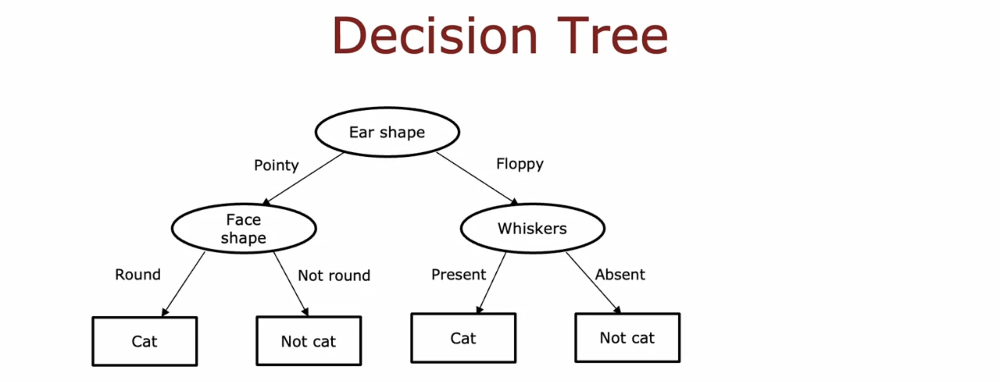
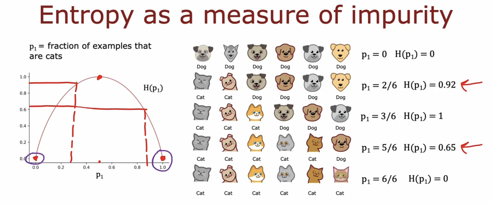
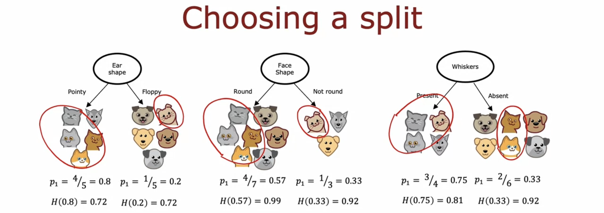
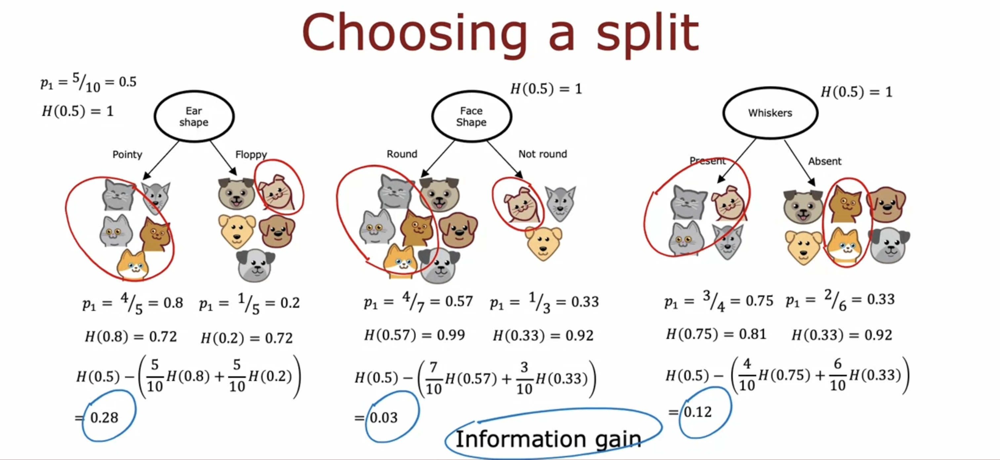
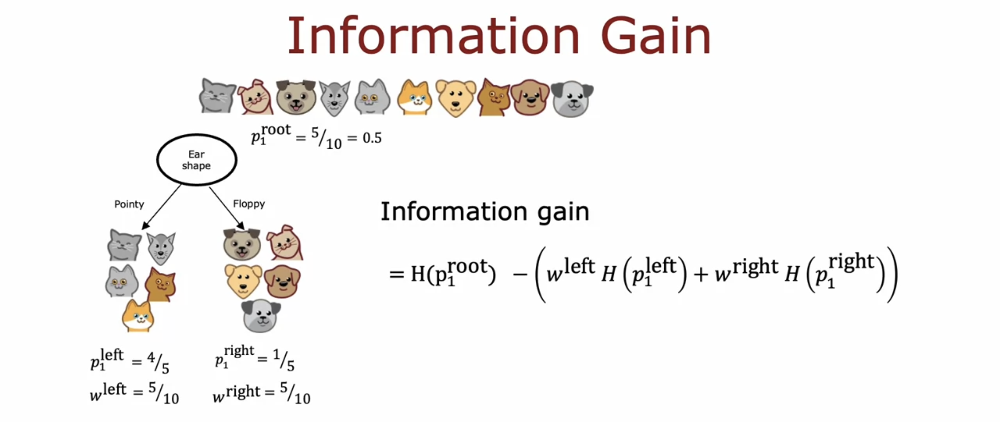

## Decision Trees

A **Decision Tree** is a supervised machine learning algorithm used for both classification and regression tasks. It mimics human decision-making by breaking down a dataset into smaller subsets while developing an associated tree structure. The final output is a tree with decision nodes and leaf nodes.

**Key Components**

1. **Root Node**: Represents the entire dataset and the starting point of the tree.
2. **Decision Nodes**: Represent splits based on features to partition data.
3. **Leaf Nodes**: Represent the final output (class label or predicted value).
4. **Branches**: Represent the outcome of a decision rule.



---

## How to Build a Decision Tree

Building a decision tree involves the following steps:

#### 1. Select the Best Feature for Splitting
- Evaluate all features and determine which one best splits the data. 
- This is done by measuring the **Information Gain (IG)** or **Gini Impurity** of each feature.

#### 2. Split the Data
- Based on the selected feature, divide the dataset into subsets. 
- Each subset should be more homogeneous in terms of the target variable.

#### 3. Repeat the Process
- Recursively apply Steps 1 and 2 to each subset until one of the following stopping conditions is met:
  - All data in a subset belongs to the same class (classification).
  - Maximum depth of the tree is reached.
  - The number of samples in a subset is below a threshold.
  - Information gain becomes negligible.

#### 4. Assign Leaf Nodes
- At the end of the process, assign a class label (classification) or a predicted value (regression) to the leaf nodes.

---

## Entropy

**Entropy** measures the **impurity or uncertainty** in a dataset. It quantifies how mixed the target classes are within a node. The goal of a decision tree is to **reduce entropy** with each split.

Formula for Entropy:

$$
\Large H = -\sum_{i=1}^n p_i \log_2 p_i
$$

$$
\Large H[X] = -\sum_{i=1}^{N}P(X=a_i) \log_2{P(X=a_i)}
$$

Where:
- $p_i$ is the proportion of samples belonging to class $i$ in the dataset.
- $n$ is the total number of classes.

#### Example:
- If a node contains 50 apples and 50 oranges, the entropy is high because the node is mixed.
- If a node contains only 100 apples, the entropy is 0 (pure node).






---

## Information Gain

**Information Gain (IG)** measures how much entropy is reduced after splitting the data on a feature. It helps determine the best feature to split on at each step. Formula for Information Gain:

**Expanded formula:**
$$
\Large IG = H_{\text{parent}} - \sum_{k=1} \left( \frac{n_k}{n} \cdot H_{\text{child}_k} \right)
$$

Where:
- $H_{\text{parent}}$ is the entropy of the parent node.
- $H_{\text{child}_k}$ is the entropy of the $k$-th child node after splitting.
- $n_k$ is the number of samples in the $k$-th child node.
- $n$ is the total number of samples in the parent node.

**General formula:**
$$
\Large IG(Y, X) = H[Y] - H[Y | X]
$$

Where:
- $H[Y]$ is the entropy of the target variable $Y$.
- $H[Y | X]$ is the conditional entropy of $Y$ given $X$.

### Example 1 (Expanded formula):
1. Compute the entropy of the parent node.
2. Split the dataset on a feature.
3. Compute the weighted entropy of the child nodes.
4. Subtract the child entropy from the parent entropy to get the IG.





### Example 2 (General formula):

#### Dataset:
Consider the data points below. The Weather, Wind, and Temperature are features, and we want to use a decision tree to decide whether it is ok to play outside.

| **Weather** | **Wind**  | **Temperature** | **Play?** |
|-------------|-----------|-----------------|-----------|
| Sunny       | Weak      | Hot             | +         |
| Sunny       | Strong    | Hot             | -         |
| Rain        | Weak      | Cold            | -         |
| Rain        | Weak      | Hot             | +         |
| Cloudy      | Strong    | Cold            | -         |
| Cloudy      | Weak      | Cold            | +         |
| Rain        | Strong    | Cold            | -         |

#### **Step 1: Calculate \(H(Play)\) (Entropy of the Parent Node)**

##### Class Distribution for Play:
- \(+\): 3 (Yes)
- \(-\): 4 (No)
- Total: 7

\[
H(Play) = - P(+) \log_2 P(+) - P(-) \log_2 P(-)
\]
\[
H(Play) = - \frac{3}{7} \log_2 \frac{3}{7} - \frac{4}{7} \log_2 \frac{4}{7} = 1.0403 \, \text{bits}
\]

#### **Step 2: Compute \(H(Play | Feature)\) for Each Feature**

##### **2.1. Conditional Entropy for Weather**
Class distribution for each value of `Weather`:
- **Sunny (2 samples):** \(+\): 1, \(-\): 1
  \[
  H(Play | Weather = Sunny) = -\frac{1}{2} \log_2 \frac{1}{2} - \frac{1}{2} \log_2 \frac{1}{2} = 1.0
  \]
- **Rain (3 samples):** \(+\): 1, \(-\): 2
  \[
  H(Play | Weather = Rain) = -\frac{1}{3} \log_2 \frac{1}{3} - \frac{2}{3} \log_2 \frac{2}{3} = 0.9183
  \]
- **Cloudy (2 samples):** \(+\): 1, \(-\): 1
  \[
  H(Play | Weather = Cloudy) = 1.0
  \]

Weighted conditional entropy:
\[
H(Play | Weather) = \frac{2}{7}(1.0) + \frac{3}{7}(0.9183) + \frac{2}{7}(1.0) = 0.9644 \, \text{bits}
\]

##### **2.2. Conditional Entropy for Wind**
Corrected class distribution for each value of `Wind`:
- **Weak (4 samples):** \(+\): 3, \(-\): 1
  \[
  H(Play | Wind = Weak) = -\frac{3}{4} \log_2 \frac{3}{4} - \frac{1}{4} \log_2 \frac{1}{4} = 0.8113
  \]

- **Strong (3 samples):** \(+\): 0, \(-\): 3
  \[
  H(Play | Wind = Strong) = -\frac{0}{3} \log_2 \frac{0}{3} - \frac{3}{3} \log_2 \frac{3}{3} = 0
  \]

Weighted conditional entropy:
\[
H(Play | Wind) = \frac{4}{7}(0.8113) + \frac{3}{7}(0) = 0.4636 \, \text{bits}
\]

##### **2.3. Conditional Entropy for Temperature**
Corrected class distribution for each value of `Temperature`:
- **Hot (3 samples):** \(+\): 2, \(-\): 1
  \[
  H(Play | Temperature = Hot) = -\frac{2}{3} \log_2 \frac{2}{3} - \frac{1}{3} \log_2 \frac{1}{3} = 0.9182
  \]

- **Cold (4 samples):** \(+\): 1, \(-\): 3
  \[
  H(Play | Temperature = Cold) = -\frac{1}{4} \log_2 \frac{1}{4} - \frac{3}{4} \log_2 \frac{3}{4} = 0.8113
  \]

Weighted conditional entropy:
\[
H(Play | Temperature) = \frac{3}{7}(0.9182) + \frac{4}{7}(0.8113) = 0.8571 \, \text{bits}
\]

#### **Step 3: Compute \(IG(Play, Feature)\) for Each Feature**

Use the formula:
\[
IG(Play, Feature) = H(Play) - H(Play | Feature)
\]

- **Weather:**
  \[
  IG(Play, Weather) = 1.0403 - 0.9644 = 0.0759 \, \text{bits}
  \]

- **Wind:**
  \[
  IG(Play, Wind) = 1.0403 - 0.4636 = 0.5767 \, \text{bits}
  \]

- **Temperature:**
  \[
  IG(Play, Temperature) = 1.0403 - 0.8571 = 0.1832 \, \text{bits}
  \]

#### **Step 4: Select the Feature with the Highest \(IG\)**
- \(IG(Play, Weather) = 0.0759 \, \text{bits}\)
- \(IG(Play, Wind) = 0.5767 \, \text{bits}\)
- \(IG(Play, Temperature) = 0.1832 \, \text{bits}\)

#### **Conclusion:**
The feature `Wind` has the highest Information Gain (\(0.5767\)), so it should be selected as the first node in the decision tree.


---

## Algorithms

#### 1. Decision Tree Train

```python
DecisionTreeTrain(data, features):
    # Step 1: Guess the most frequent label
    guess ← most frequent label in data

    # Step 2: Check stopping conditions
    if all labels in data are the same:
        return LEAF(guess)  # Base case: Pure node, return a leaf with the label
    if features is empty:
        return LEAF(guess)  # Base case: No features left, return a leaf with majority label

    # Step 3: Select the best feature
    best_feature ← the feature in features that maximizes Information Gain

    # Step 4: Split the data based on the best feature
    NO ← subset of data where best_feature = NO
    YES ← subset of data where best_feature = YES

    # Step 5: Recursive calls
    left ← DecisionTreeTrain(NO, features - {best_feature})   # Recurse on the NO subset
    right ← DecisionTreeTrain(YES, features - {best_feature}) # Recurse on the YES subset

    # Step 6: Return a node that combines the feature and its subtrees
    return NODE(best_feature, left, right)
```

#### 2. Decision Tree Predict

```python
DecisionTreePredict(tree, instance):
    # Step 1: Check if the current node is a leaf
    if tree has form LEAF(guess):
        return guess  # Base case: return the label stored in the leaf

    # Step 2: Check if the current node is a decision node
    else if tree has form NODE(f, left, right):
        # Step 3: Evaluate the feature f for the given instance
        if f = NO in instance:
            return DecisionTreePredict(left, instance)  # Recurse on the left subtree
        else:
            return DecisionTreePredict(right, instance)  # Recurse on the right subtree
```

---

## Algorithm Demonstration

#### Dataset Example

| Rainy?        | Windy?        | Play? (Label) |
|---------------|---------------|---------------|
| Yes           | No            | Yes           |
| Yes           | Yes           | No            |
| No            | No            | Yes           |
| No            | Yes           | No            |

---

#### Step 1: Initial Call to `DecisionTreeTrain(data, features)`

##### Inputs:
- **data**: Entire dataset above.
- **features**: `{Rainy, Windy}` (the two features we can use for splitting).

##### Guess the Most Frequent Label:
- Count the labels:
  - `Yes`: 2 occurrences
  - `No`: 2 occurrences
- **Guess**: Arbitrarily choose one (e.g., `Yes`).

##### Check Conditions:
1. Are all labels in `data` the same? **No.**
2. Is `features` empty? **No.**

Proceed to find the **best feature** to split the data.

---

#### 2. Select the "Best" Feature

We calculate **Information Gain (IG)** for each feature to find the best one.

##### Calculate IG for Feature `Rainy`:
1. Split the data:
   - `Rainy = Yes` → Subset: `{Row 1, Row 2}` (Labels: **Yes, No**).
   - `Rainy = No` → Subset: `{Row 3, Row 4}` (Labels: **Yes, No**).

2. Compute Entropy of Parent Node:
   - Parent Node Labels: `{Yes, Yes, No, No}`
   - Entropy:
     $$
     H = -\sum p_i \log_2 p_i = -\left(\frac{2}{4}\log_2\frac{2}{4} + \frac{2}{4}\log_2\frac{2}{4}\right) = 1.0
     $$

3. Compute Entropy of Each Subset:
   - `Rainy = Yes`: `{Yes, No}` (Entropy = 1.0).
   - `Rainy = No`: `{Yes, No}` (Entropy = 1.0).

4. Weighted Entropy After Split:
   $$
   H_{split} = \frac{2}{4} \cdot 1.0 + \frac{2}{4} \cdot 1.0 = 1.0
   $$

5. Information Gain:
   $$
   IG = H_{parent} - H_{split} = 1.0 - 1.0 = 0.0
   $$


##### Calculate IG for Feature `Windy`:
1. Split the data:
   - `Windy = No` → Subset: `{Row 1, Row 3}` (Labels: **Yes, Yes**).
   - `Windy = Yes` → Subset: `{Row 2, Row 4}` (Labels: **No, No**).

2. Compute Entropy of Parent Node:
   - Already computed: $H_{parent} = 1.0$.

3. Compute Entropy of Each Subset:
   - `Windy = No`: `{Yes, Yes}` (Entropy = 0.0).
   - `Windy = Yes`: `{No, No}` (Entropy = 0.0).

4. Weighted Entropy After Split:
   $$
   H_{split} = \frac{2}{4} \cdot 0.0 + \frac{2}{4} \cdot 0.0 = 0.0
   $$

5. Information Gain:
   $$
   IG = H_{parent} - H_{split} = 1.0 - 0.0 = 1.0
   $$


##### Choose the Best Feature:
- `Rainy` has $IG = 0.0$.
- `Windy` has $IG = 1.0$.

##### **Best Feature = Windy.**

---

#### 3. Split Data on `Windy`

- `Windy = No` → Subset: `{Row 1, Row 3}` (Labels: **Yes, Yes**).
- `Windy = Yes` → Subset: `{Row 2, Row 4}` (Labels: **No, No**).

##### Recursive Calls:
1. **Left Subtree**: `DecisionTreeTrain(NO, features - {Windy})`
   - **data** = `{Row 1, Row 3}` (Labels: **Yes, Yes**).
   - **Guess**: **Yes**.
   - All labels are the same → Return `Leaf(Yes)`.

2. **Right Subtree**: `DecisionTreeTrain(YES, features - {Windy})`
   - **data** = `{Row 2, Row 4}` (Labels: **No, No**).
   - **Guess**: **No**.
   - All labels are the same → Return `Leaf(No)`.

---

#### 4. Build the Tree

Combine the results into a tree:

```scss
Node(Windy)
├── If Windy = No → Leaf(Yes)
└── If Windy = Yes → Leaf(No)
```

---

#### 5. Test with a New Example

##### Example Test Point:
- `Rainy = Yes`, `Windy = No`.

##### Process:
1. Start at the root: `Node(Windy)`.
2. Test `Windy = No` → Go to the left child: `Leaf(Yes)`.
3. **Prediction**: **Yes**.

---

## Hyperparameters

Hyperparameters in decision trees are values set before the training process that influence the tree's complexity, structure, and generalization ability. Unlike model parameters, which are learned from the data, hyperparameters must be tuned through a validation process to achieve optimal performance.

The primary hyperparameter discussed in this lecture is:
- **Maximum Depth (Max Depth) of the Tree** – This controls the maximum number of levels the decision tree can grow.

---

#### **Choosing the Max Depth: A Trade-Off**
- **Generalization Control**: Max Depth determines how well the model generalizes to unseen data.
- **Avoiding Overfitting**: If the tree grows too deep, it memorizes the training data instead of learning general patterns.
- **Avoiding Underfitting**: If the tree is too shallow, it fails to capture enough structure in the data.

---

#### **Train-Dev-Test Split**

##### **Data Partitioning for Model Training**
A dataset is typically divided into three subsets:
- **Training Data (\(D_{train}\))**: Used to train the model.
- **Validation Data (\(D_{dev}\))**: Used to tune hyperparameters.
- **Test Data (\(D_{test}\))**: Used to evaluate the final model.

Each subset serves a distinct purpose in ensuring the model performs well on new, unseen data.

---

#### **Hyperparameter Tuning Strategies**
There are different strategies for selecting the best max depth for a decision tree:

##### **1. Using a Validation Set**
- Train multiple models using different max depths.
- Evaluate each model on the validation set.
- Choose the depth that provides the best validation performance.

##### **2. Cross-Validation (CV)**
If a separate validation set is unavailable, **k-fold cross-validation** is used:
1. Split the training dataset into \(K\) equal parts (folds).
2. Train the model on \(K-1\) folds and validate it on the remaining fold.
3. Repeat this process \(K\) times, each time using a different fold for validation.
4. Average the results to determine the best max depth.

**Common values for \(K\) in Cross-Validation:**
- \(K=5\) (5-fold CV)
- \(K=10\) (10-fold CV, commonly used)
- \(K=N\) (Leave-One-Out CV, where each instance serves as a test set once)

---

#### **Example of Hyperparameter Selection**
Suppose we are training a decision tree on a dataset, and we consider different values for max depth:

| **Max Depth** | **Training Accuracy** | **Validation Accuracy** |
|--------------|------------------|------------------|
| 1            | 60%              | 58%              |
| 3            | 78%              | 74%              |
| 5            | 88%              | 84%              |
| 7            | 99%              | 76%              |

- If we choose **Max Depth = 7**, the training accuracy is high (99%), but validation accuracy drops (76%), indicating **overfitting**.
- If we choose **Max Depth = 5**, validation accuracy is higher, suggesting better generalization.

Thus, the best choice would be **Max Depth = 5**, as it provides the best trade-off.

---

#### **Final Recipe for Hyperparameter Selection**
1. **Split the dataset into \(D_{train}\), \(D_{dev}\), and \(D_{test}\)**.
2. **Train models with different max depths**.
3. **Evaluate performance for models with different max depths on the validation set \(D_{dev}\)**.
4. **Select the hyperparameter with the best validation performance**.
5. **Train the final model using the selected hyperparameter and evaluate on \(D_{test}\)**.
