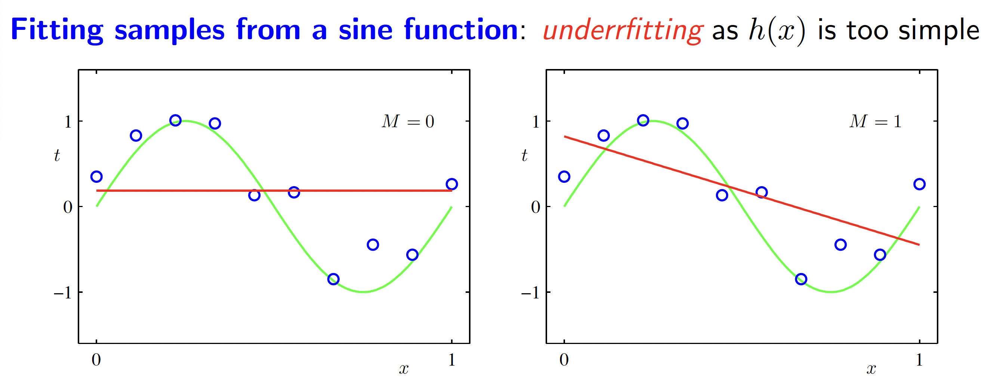
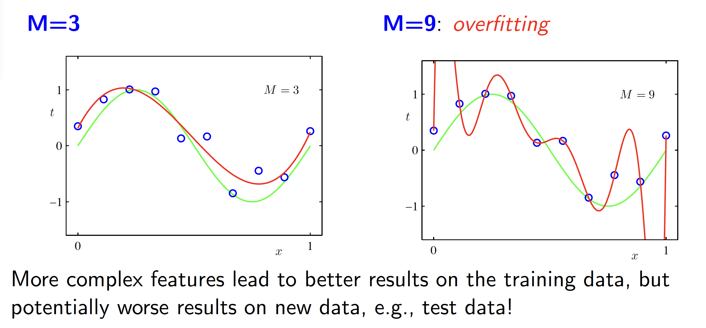

# Nonlinear Regression

> #### Why Do We Need Nonlinear Hypotheses?
>
> - **Linear regression** assumes a straight-line relationship between inputs and outputs.
> - However, real-world data often exhibits **curved** or **complex** patterns that cannot be captured by a simple linear model.
> - To model these complex relationships, we **transform the input features** into a **higher-dimensional space** using **basis functions**.

---

## Mathematical Representation

A nonlinear transformation of input features can be expressed as:

\[
\phi(x) : x \in \mathbb{R}^D \to z \in \mathbb{R}^M
\]

where:

- \( D \) is the number of original features.
- \( M \) is the number of transformed features (which could be greater than, equal to, or less than \( D \)).

#### Polynomial Basis Functions

A common nonlinear transformation is the **polynomial basis function**, which expands a scalar input \( x \) into higher powers:

\[
\phi(x) =
\begin{bmatrix}
1 \\
x \\
x^2 \\
\vdots \\
x^M
\end{bmatrix}
\]

The hypothesis function (model) using this transformation is:

\[
h(x) = \theta_0 + \sum_{m=1}^{M} \theta_m x^m
\]

where:

- \( M \) determines the polynomial order (complexity).
- The parameters \( \theta_m \) are learned from the data.

---

## Example: Fitting a Polynomial Regression

Let's consider a **real-world example**: predicting house prices based on the **square footage**.

#### Dataset:

| House # | Square Footage (\( x \)) | Price (\( y \)) (in $1000s) |
|---------|------------------|--------------------|
| 1       | 800              | 150                |
| 2       | 1000             | 180                |
| 3       | 1200             | 210                |
| 4       | 1500             | 250                |
| 5       | 1800             | 290                |

#### Case 1: Linear Regression (\( M = 1 \))

If we fit a simple **linear model**:

\[
h(x) = \theta_0 + \theta_1 x
\]

- This assumes house prices increase **linearly** with square footage.
- However, in reality, **house prices may increase at a faster rate for larger homes**.

#### Case 2: Quadratic Polynomial (\( M = 2 \))

Instead of using just \( x \), we **add a squared term**:

\[
h(x) = \theta_0 + \theta_1 x + \theta_2 x^2
\]

- This allows the model to **capture acceleration** in price growth.
- It bends the line to better **fit** the actual prices.

#### Case 3: High-Order Polynomial (\( M = 9 \))

\[
h(x) = \theta_0 + \sum_{m=1}^{9} \theta_m x^m
\]

- This fits the training data **very well**.
- However, it may **overfit**, meaning it captures noise instead of the true trend.

---

## Overfitting vs. Underfitting

#### Underfitting 

where **(\( M = 1 \))**, the model is too simple and fails to capture the pattern.

#### Overfitting

where **(\( M = 9 \))**, the model memorizes training data but performs poorly on new data.

**Best Choice**: A moderate \( M \) (e.g., \( M = 2 \) or \( M = 3 \)) provides a **good balance** between bias and variance.
