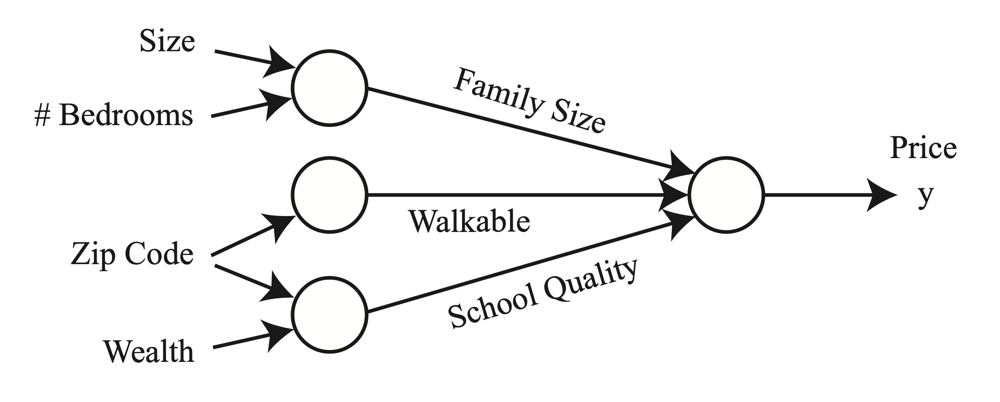

## Deep Learning?

Deep Learning is a subset of Machine Learning that uses **artificial neural networks (ANNs)** with multiple layers to learn complex patterns from data. Unlike traditional ML algorithms, deep learning models **automatically** extract hierarchical features from raw data, making them highly effective for tasks like image recognition, speech processing, and natural language understanding.

##### Key Difference from Traditional ML:

- **Feature Engineering**: In traditional ML, features are manually crafted, whereas deep learning models **learn features automatically**.
- **Scalability**: Deep learning excels with large-scale data and computational resources (e.g., GPUs).
- **Model Complexity**: Uses deep architectures (many layers), enabling better generalization for complex problems.

## Neural Network?

A neural network is the core component of deep learning. It is **inspired by the human brain**, consisting of **layers of neurons** (also called units or nodes). Each neuron takes inputs, applies weights, and passes an output through an **activation function**.

##### Basic Structure of a Neural Network:

1. **Input Layer**: Receives raw data (e.g., pixel values, numerical features).
2. **Hidden Layers**: Perform transformations and extract hierarchical features.
3. **Output Layer**: Produces the final prediction (classification, regression, etc.).

Each connection in the network has a **weight**, which determines the strength of the signal between neurons. The network **learns** by adjusting these weights through a process called **backpropagation** using an optimization algorithm like **Stochastic Gradient Descent (SGD) or Adam**.

##### Types of Neural Networks

Neural networks come in different architectures, each suited for different tasks:

| **Neural Network Type** | **Use Case** |
|-------------------------|-------------|
| **Feedforward Neural Networks (FNNs)** | Basic classification and regression tasks |
| **Convolutional Neural Networks (CNNs)** | Image processing and computer vision |
| **Recurrent Neural Networks (RNNs)** | Sequential data, time series, NLP |
| **Long Short-Term Memory (LSTM)** | Improved RNNs for long-term dependencies |
| **Transformers (e.g., BERT, GPT)** | State-of-the-art NLP models |
| **Generative Adversarial Networks (GANs)** | Image generation, deepfake creation |

---

## Activation Functions?

Activation functions **define how the output of a neuron is transformed based on its inputs**. They introduce **non-linearity**, enabling neural networks to approximate complex functions and learn intricate patterns. Without activation functions, a neural network would simply behave like a linear model, no matter how many layers it has.

#### **1. Sigmoid (Logistic) Function**
$$
\sigma(x) = \frac{1}{1 + e^{-x}}
$$
- **Range**: \( (0,1) \)
- **Properties**:
  - Converts input into a probability-like value.
  - Suitable for binary classification tasks.
- **Issues**:
  - **Vanishing Gradient Problem**: When the input is too large or too small, the derivative approaches zero, making learning slow.
  - **Not Zero-Centered**: Outputs are always positive, leading to inefficient weight updates.

#### **2. ReLU (Rectified Linear Unit)**
$$
\text{ReLU}(x) = \max(0, x)
$$
- **Range**: \( [0, \infty) \)
- **Properties**:
  - Computationally efficient.
  - Does not suffer from vanishing gradient for positive values.
- **Issues**:
  - **Dying ReLU Problem**: When inputs are negative, the gradient is zero, meaning certain neurons might never activate.

#### **3. Tanh (Hyperbolic Tangent) Function**
$$
\tanh(x) = \frac{e^x - e^{-x}}{e^x + e^{-x}}
$$
- **Range**: \( (-1,1) \)
- **Properties**:
  - Zero-centered, meaning negative inputs map to negative values and positive inputs to positive values.
  - Works better than sigmoid in deep networks.
- **Issues**:
  - Still suffers from the vanishing gradient problem for extreme values.

#### **4. Softmax Function**
$$
\text{Softmax}(x_i) = \frac{e^{x_i}}{\sum_{j} e^{x_j}}
$$
- **Used in**: Multi-class classification problems.
- **Properties**:
  - Converts a vector into a probability distribution (sums to 1).
  - Helps in classification by emphasizing the largest value.

#### **Comparisons**

| Activation Function | Output Range | Pros | Cons | Use Case |
|---------------------|-------------|------|------|----------|
| Sigmoid | \((0,1)\) | Good for probabilities | Vanishing gradient, not zero-centered | Binary classification |
| ReLU | \([0,\infty)\) | Simple and efficient | Dying ReLU problem | Most deep networks |
| Tanh | \((-1,1)\) | Zero-centered | Vanishing gradient | Some classification tasks |
| Softmax | \((0,1)\) | Converts scores into probabilities | Requires normalization | Multi-class classification |

- **For hidden layers**, ReLU (or its variants) is often the best choice due to its simplicity and effectiveness.
- **For output layers**, use:
  - **Sigmoid** for binary classification.
  - **Softmax** for multi-class classification.
- Advanced variants like **Leaky ReLU, PReLU, and ELU** can help improve deep networks by mitigating issues like vanishing gradients or dying neurons.

---

## Example: Predicting House Prices

### Inputs: \( x_1, x_2, x_3, x_4 \)

The model takes in **four input features**:
- \( x_1 \): **Size** of the house.
- \( x_2 \): **Number of bedrooms**.
- \( x_3 \): **Zip code** (location).
- \( x_4 \): **Wealth** (socioeconomic factor of the area).

These inputs are the **raw data** that will be transformed into useful intermediate representations.

### Intermediate Variables (Hidden Layer)

Instead of directly predicting **house price**, the model **derives intermediate variables**:
- **Family Size** (\( a_1 \)): Depends on **Size and Bedrooms**.
- **Walkability** (\( a_2 \)): Depends on **Zip Code**.
- **School Quality** (\( a_3 \)): Depends on **Zip Code and Wealth**.

Each intermediate variable is computed using a **weighted sum** of relevant inputs, followed by a **ReLU activation function**.

### Equations for Hidden Layer (Feature Mapping)

Each neuron applies the **ReLU activation** to its weighted input:

\[
a_1 = \text{ReLU}(\theta_1 x_1 + \theta_2 x_2 + \theta_3)
\]

\[
a_2 = \text{ReLU}(\theta_4 x_3 + \theta_5)
\]

\[
a_3 = \text{ReLU}(\theta_6 x_3 + \theta_7 x_4 + \theta_8)
\]

where:
- \( \theta \) values are **learnable weights**.
- The **bias terms** (\( \theta_3, \theta_5, \theta_8 \)) allow **flexibility in learning**.
- **ReLU** ensures that only **positive values** pass forward, introducing **non-linearity**.

### Output Layer (Predicting Price \( y \))

Once **Family Size, Walkability, and School Quality** are computed, they are used to predict **house price \( y \)**:

\[
y = f(W_3 \cdot (a_1, a_2, a_3) + b_3)
\]

- \( W_3 \) represents the **final layer weights**.
- The activation function \( f(\cdot) \) is often **linear** (for regression) or **softmax** (for classification).

---

### Q1. Is Each ReLU Like a Single Linear Regression?

Not exactly. A **ReLU activation** follows a **linear transformation**, but it **introduces non-linearity** by setting negative values to zero.

1. **Linear Regression** (Traditional ML):
   - A single linear regression model follows:
     \[
     y = w_1 x_1 + w_2 x_2 + \dots + b
     \]
   - This means it can only model **linear relationships** between input features and output.

2. **Neural Network with ReLU (Deep Learning):**
   - Each neuron performs a **linear transformation**:
     \[
     z = \theta_1 x_1 + \theta_2 x_2 + \theta_3
     \]
   - Then applies **ReLU**:
     \[
     a = \max(0, z)
     \]
   - **Key Difference:** If \( z \) is negative, **ReLU sets it to zero**. This introduces **non-linearity**, which is impossible with standard linear regression.

**ReLU is like a "piecewise" linear regression:**
- It behaves **linearly for positive values** but **clips negative values to zero**.
- This allows a neural network to **stack multiple layers** and learn **complex relationships**.

---

### Q2. What Does \( a \) Refer To?

In the context of neural networks, **\( a \)** represents the **activation (output) of a neuron**.

For example:
\[
a_1 = \text{ReLU}(\theta_1 x_1 + \theta_2 x_2 + \theta_3)
\]

- **Before ReLU (Linear Transformation):**
  \[
  z = \theta_1 x_1 + \theta_2 x_2 + \theta_3
  \]
- **After ReLU Activation:**
  \[
  a_1 = \max(0, z)
  \]

These values **become the input to the next layer**!

Deep learning works by **stacking multiple hidden layers**, each with **ReLU (or other activation functions)**, to **progressively learn higher-level features**. The final layer then **produces the desired output** (e.g., house price prediction).

---

## Two-Layer Neural Network

> .
>
>
> In this figure, we have used circles to also denote the inputs to the network. The circles labeled “+1” are called **bias units**, and correspond to the intercept term. The leftmost layer of the network is called the **input layer**, and the rightmost layer the **output layer** (which, in this example, has only one node). The middle layer of nodes is called the **hidden layer**, because its values are not observed in the training set. We also say that our example neural network has **3 input units (not counting the bias unit), 3 hidden units, and 1 output unit**.
>.

#### 1. Fully Connected Neural Network
- Instead of manually defining "Family Size," "Walkability," and "School Quality" as intermediate variables, we **let the network learn hidden representations by themselves (without giving them predefine intermediate variables)**.
- Each **hidden unit** learns a combination of **input features** using **weights (\(W\)) and biases (\(b\))**.

#### 2. Mathematical Formulation (Two-Layer Network)
- The **first layer** computes intermediate activations (**\(n = 3\)** in this example):

  \[
  a_1 = \text{ReLU}(W_1 x + b_1)
  \]

  \[
  a_2 = \text{ReLU}(W_2 x + b_2)
  \]

  \[\dots\]

  \[
  a_n = \text{ReLU}(W_n x + b_n)
  \]

- The **second layer** takes these activations and produces the final output:

  \[
  h_{\theta}(x) = W^{[2]} a + b^{[2]}
  \]

- **Explanation:**
  - \( W^{[1]} \) represents the **weights of the first layer** (mapping inputs to hidden neurons).
  - \( W^{[2]} \) represents the **weights of the second layer** (mapping hidden neurons to output).
  - **ReLU activation** is applied to the hidden layer outputs.

#### 3. Interpretation of \( h_{\theta}(x) \)
- This final equation **computes the predicted house price**.
- The network **automatically learns feature interactions**, removing the need for manually defined **"Family Size," "Walkability," etc.**
