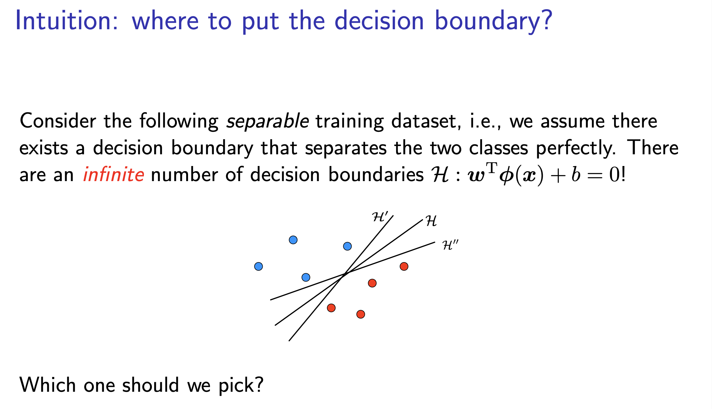
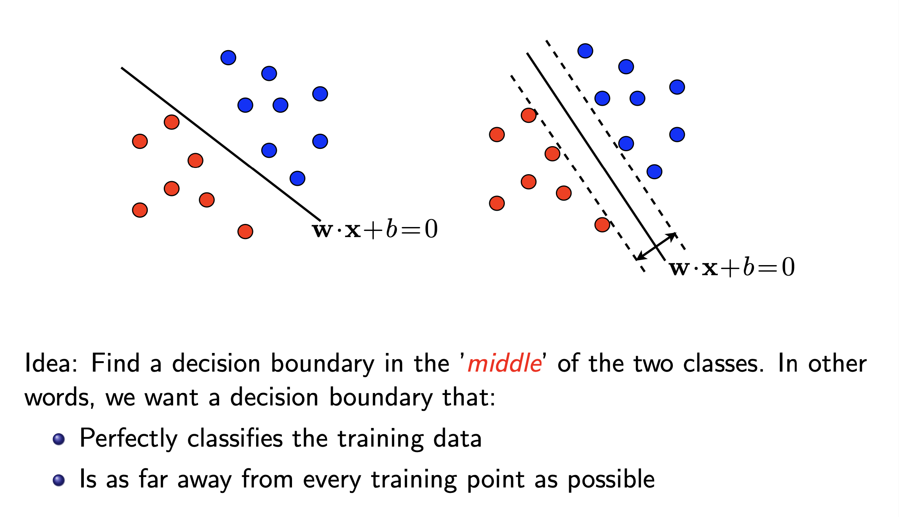
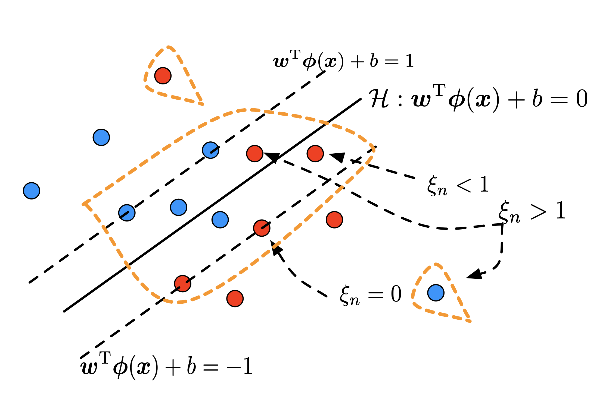

### Linear Classification and Perceptron

Linear classification is the simplest form of supervised learning where the goal is to separate data points using a straight line (in 2D), a plane (in 3D), or a hyperplane (in higher dimensions).

### Perceptron

The **perceptron** is one of the earliest algorithms for linear classification, introduced by **Frank Rosenblatt** in 1958. It is a binary classifier that updates its decision boundary based on misclassified points.

##### Mathematical Formulation

Given a dataset \( \{(\mathbf{x}_i, y_i)\}_{i=1}^{n} \), where:

- \( \mathbf{x}_i \in \mathbb{R}^d \) is the feature vector.
- \( y_i \in \{-1, +1\} \) is the label.

The perceptron defines a linear decision boundary:

\[
f(\mathbf{x}) = \text{sign}(\mathbf{w}^T \mathbf{x} + b)
\]

where:

- \( \mathbf{w} \in \mathbb{R}^d \) is the weight vector.
- \( b \) is the bias term.

##### Learning Rule

The perceptron uses an iterative update when it misclassifies a point:

\[
\mathbf{w} \leftarrow \mathbf{w} + \eta y_i \mathbf{x}_i
\]

\[
b \leftarrow b + \eta y_i
\]

where \( \eta \) is the learning rate.

##### Limitations

- **Only works if data is linearly separable**: If the dataset is **not** linearly separable, the perceptron will **not converge**.
- **Multiple possible solutions**: The perceptron does not find the "best" linear boundary, only one that works.

---

## Support Vector Machines (SVMs)

While the perceptron can find a linear separator, it **does not** ensure that it is the **best** separator. Support Vector Machines (SVMs) address this by **maximizing the margin**, leading to better generalization for classifiers.

Instead of just finding any separating hyperplane, SVMs look for the one that **maximizes the margin**—the distance between the hyperplane and the closest data points (support vectors).

#### Mathematical Formulation

The decision boundary in SVM is:

\[
f(\mathbf{x}) = \text{sign}(\mathbf{w}^T \mathbf{x} + b)
\]

The goal is to maximize the margin, which is defined as:

\[
\frac{2}{\|\mathbf{w}\|}
\]

subject to the constraint that all points are classified correctly:

\[
y_i (\mathbf{w}^T \mathbf{x}_i + b) \geq 1, \quad \forall i
\]

This leads to the **optimization problem**:

\[
\min_{\mathbf{w}, b} \quad \frac{1}{2} \|\mathbf{w}\|^2_2
\]

subject to:

\[
y_i (\mathbf{w}^T \mathbf{x}_i + b) \geq 1, \quad \forall i
\]

This is a **convex quadratic optimization problem**, which can be solved efficiently using **Lagrange multipliers**.

---

## What is Margin in Perceptron?

In the context of **binary classification**, the **margin** refers to the distance between the decision boundary (hyperplane) and the closest data points from either class. The concept of margin is fundamental in **Support Vector Machines (SVMs)** because maximizing it leads to better generalization and robustness.

### 1. Understanding the Margin in a Linear Classifier

Given a **linear decision boundary**:

\[
f(\mathbf{x}) = \mathbf{w}^T \mathbf{x} + b
\]

where:

- \( \mathbf{w} \in \mathbb{R}^d \) is the weight vector.
- \( b \) is the bias term.
- The decision boundary is given by \( \mathbf{w}^T \mathbf{x} + b = 0 \).

For any point \( \mathbf{x}_i \) in the dataset with label \( y_i \in \{-1, +1\} \), the signed distance from \( \mathbf{x}_i \) to the hyperplane is:

\[
\frac{y_i (\mathbf{w}^T \mathbf{x}_i + b)}{\|\mathbf{w}\|}
\]

The **margin** is defined as the minimum of this distance over all data points:

\[
\gamma = \min_i \frac{|\mathbf{w}^T \mathbf{x}_i + b|}{\|\mathbf{w}\|}
\]

- If the margin is **large**, it means the classifier is making confident predictions and is less sensitive to noise.
- If the margin is **small**, the classifier is more prone to misclassifications due to small perturbations in the data.

### 2. Hard Margin vs. Soft Margin SVMs

#### (a) Hard Margin SVM

If the data is **perfectly linearly separable**, we can find a separating hyperplane that satisfies:

\[
y_i (\mathbf{w}^T \mathbf{x}_i + b) \geq 1, \quad \forall i
\]

The margin is then:

\[
\frac{2}{\|\mathbf{w}\|}
\]

Maximizing this margin leads to the **optimal separating hyperplane**.

However, real-world data is often **not** perfectly separable.

#### (b) Soft Margin SVM

To handle **overlapping classes** and **noisy data**, we introduce **slack variables (\(\xi_i\))**:

\[
y_i (\mathbf{w}^T \mathbf{x}_i + b) \geq 1 - \xi_i, \quad \xi_i \geq 0
\]

This allows some points to be misclassified but **penalizes** large misclassifications. The new objective function is:

\[
\min_{\mathbf{w}, b} \quad \frac{1}{2} \|\mathbf{w}\|^2 + C \sum_i \xi_i
\]

where \( C \) controls the trade-off between maximizing margin and allowing misclassifications.

- A **large \( C \)** tries to **minimize misclassification**, leading to a **smaller margin**.
- A **small \( C \)** allows **more misclassifications** but results in a **larger margin**.

#### Comparison: Perceptron vs. SVM

| Feature         | Perceptron                           | SVM                                  |
|---------------|-----------------------------------|-------------------------------------|
| **Convergence** | Converges if data is linearly separable | Always finds optimal margin |
| **Optimality** | Any separating hyperplane | Maximizes margin for best generalization |
| **Non-separable Data** | Fails | Uses soft margin to allow some errors |
| **Robustness** | Sensitive to noise | More robust to noise |

This flow ensures a smooth transition from the perceptron (a simple but limited linear classifier) to SVM (a more powerful and optimal classifier).

---

### Q1. Why is the Margin Not Fixed?

#### The Smallest Distance is Not Fixed Until You Choose a Hyperplane

You are correct in thinking that **for a given hyperplane**, the margin (smallest distance to the closest point) is **fixed**. However, the key idea in **Support Vector Machines (SVMs)** is that we are **not given the hyperplane in advance**—we must choose it.

#### SVM Chooses the Hyperplane that Maximizes this Smallest Distance

Now, when we say **"maximizing the margin"**, what we mean is:

- Among **all possible valid separating hyperplanes**, we pick the one where the smallest distance to the closest point is **as large as possible**.

In other words:

\[
\max_{\mathbf{w}, b} \left( \min_i \frac{\left| \mathbf{w}^T \mathbf{x}_i + b \right|}{\|\mathbf{w}\|} \right)
\]

This is what makes the SVM hyperplane **unique** and **optimal**.

---

### Q2. What is "support vectors" in SVMs

- The SVM solution is only determined by **a subset of the training instances**. These instances are called **support vectors**.
- All other training points do not affect the optimal solution, i.e., if we remove the other points and construct another SVM classifier on the reduced dataset, the optimal solution will be the same.

---

### Q3. Visualization of how training data points are categorized

***Support vectors*** are highlighted by the dotted orange lines.

1. **Hyperplanes**:
   - The solid black line represents the decision boundary:
     $$
     \mathcal{H} : \mathbf{w}^T \phi(\mathbf{x}) + b = 0
     $$
   - The two dashed black lines represent the margin boundaries:
     $$
     \mathbf{w}^T \phi(\mathbf{x}) + b = \pm 1
     $$

2. **Support Vectors**:
   - The **orange dotted lines** enclose the **support vectors**, which are the critical data points lying **on or inside the margin**.
   - Support vectors are crucial in defining the optimal separating hyperplane.

3. **Slack Variables** \( \xi_n \):
   - \( \xi_n = 0 \): The point is correctly classified and outside the margin.
   - \( 0 < \xi_n < 1 \): The point is inside the margin but correctly classified.
   - \( \xi_n > 1 \): The point is misclassified (on the wrong side of the decision boundary).

---

### Q4. Is the margin in SVM the same as in the Perceptron?

No, The margin in SVM is **not** the distance between the decision boundary \(\mathbf{w}^T \phi(\mathbf{x}) + b = 0\) and the nearest point like **what perceptron does**. 

Instead, the margin in SVM is the distance **between the two margin boundaries**:
\[
\mathbf{w}^T \phi(\mathbf{x}) + b = +1
\]

\[
\mathbf{w}^T \phi(\mathbf{x}) + b = -1
\]

#### Why is This the Margin?

1. **Definition of Margin:**
   - The margin in SVM is defined as the perpendicular distance **between the two hyperplanes** that pass through the closest support vectors.
   - These hyperplanes are set at \( \mathbf{w}^T \phi(\mathbf{x}) + b = \pm1 \) through a normalization constraint.
   - The total margin width is then:

     \[
     \frac{2}{\|\mathbf{w}\|}
     \]

2. **Distance to the Nearest Point vs. Margin Width:**
   - The **distance between the decision boundary** \( \mathbf{w}^T \phi(\mathbf{x}) + b = 0 \) **and the nearest support vector** is only:

     \[
     \frac{1}{\|\mathbf{w}\|}
     \]

   - This is **half** of the actual margin width.

3. **What About \( \xi_n \) (Slack Variables)?**
   - In **soft-margin SVM**, some points violate the margin and fall within the region **between or beyond the margin boundaries**.
   - The **hard-margin SVM** enforces that all points lie outside the margin, meaning support vectors lie **exactly on the margin boundaries**.

#### Summary

- **Margin** = distance between the hyperplanes at \( \mathbf{w}^T \phi(\mathbf{x}) + b = +1 \) and \( \mathbf{w}^T \phi(\mathbf{x}) + b = -1 \), which is:

  \[
  \frac{2}{\|\mathbf{w}\|}
  \]

- **Distance between the decision boundary** \( \mathbf{w}^T \phi(\mathbf{x}) + b = 0 \) **and the nearest support vector** is **half the margin**, i.e.,

  \[
  \frac{1}{\|\mathbf{w}\|}
  \]