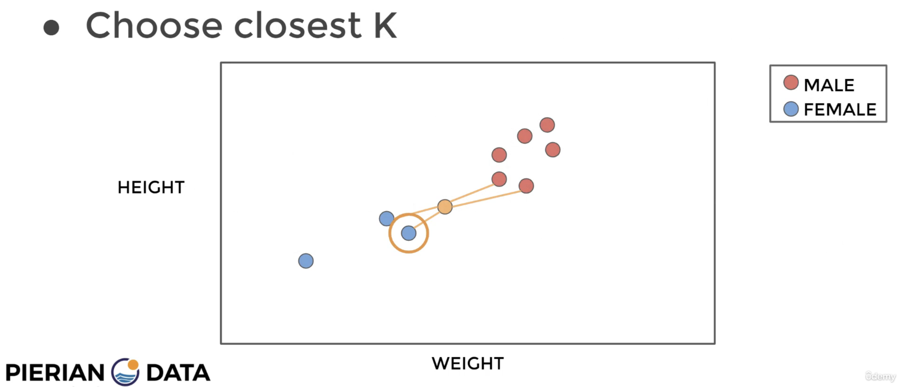

## K-Nearest Neighbors (KNN)

The **Nearest Neighbor (NN)** and **K-Nearest Neighbors (KNN)** are foundational techniques in machine learning and data analysis. They are **instance-based learning** algorithms that classify data points based on their proximity to other data points in the feature space.

---

## Nearest Neighbor (NN)

The **Nearest Neighbor** method assigns a label to a query point by finding the **single closest training example** in the feature space. It is the simplest form of the KNN algorithm where $k = 1$.

#### Distance Metrics
  - **Manhattan Distance**:
    $$
    \sum_{i=1}^{n} |x_i - y_i|
    $$

  - **Euclidean Distance**: 
    $$
    \sqrt{\sum_{i=1}^{n} (x_i - y_i)^2}
    $$

  - **Nearest Neighbor Index**:
    $$
    \text{nn}(x) = \text{arg min}_{n \in [N]} \|x - x_n\|_2^2 = \text{arg min}_{n \in [N]} \sum_{d=1}^{D} (x_d - x_{nd})^2
    $$

    - **$nn(x)$**: $\text{nn}$ stands for nearest neighbor, $\text{nn}(x)$ is the **index ${n \in [N]}$** of the training sample closest to the query point $x$.
    - **$arg\ min$**: the index $n$ that **minimizes** the squared $\ell_2$-norm (Euclidean distance) between $x$ and each training instance $x_n$.
    - **$D$**: The number of dimensions (or features) of each point $x$ and $x_n$.
    - **$x_d$**: The $d$-th component (or feature) of the query point $x$.
    - **$x_{nd}$**: The $d$-th component (or feature) of the training point $x_n$.
        - Query point ${x = (x_1,x_2) = (2,3)}$ has two dimensions (${D = 2}$).

---

#### Example

**Query Point:**
- $x = (1.5, 1.5)$

**Training Points:**
1. $x_1 = (1, 1)$
2. $x_2 = (2, 2)$
3. $x_3 = (3, 3)$

The goal is to calculate:
$$
\text{nn}(x) = \text{arg min}_{n \in [N]} \|x - x_n\|_2^2 = \text{arg min}_{n \in [N]} \sum_{d=1}^{D} (x_d - x_{nd})^2
$$

**Distance Calculation:**

1. For $x_1 = (1, 1)$:
$$
\|x - x_1\|_2^2 = \sum_{d=1}^{2} (x_d - x_{1d})^2 = (1.5 - 1)^2 + (1.5 - 1)^2 = 0.5
$$

2. For $x_2 = (2, 2)$:
$$
\|x - x_2\|_2^2 = \sum_{d=1}^{2} (x_d - x_{2d})^2 = (1.5 - 2)^2 + (1.5 - 2)^2 = 0.5
$$

3. For $x_3 = (3, 3)$:
$$
\|x - x_3\|_2^2 = \sum_{d=1}^{2} (x_d - x_{3d})^2 = (1.5 - 3)^2 + (1.5 - 3)^2 = 4.5
$$

**Nearest Neighbor Index $\text{nn}(x)$:**

Compare the squared distances:
- $\|x - x_1\|_2^2 = 0.5$
- $\|x - x_2\|_2^2 = 0.5$
- $\|x - x_3\|_2^2 = 4.5$

$$
\text{nn}(x) = \text{arg min}_{n \in [N]} \|x - x_n\|_2^2 = \|x - x_1\|_2^2 = \|x - x_2\|_2^2 = 0.5
$$

The smallest distance is **0.5**, and both $x_1$ and $x_2$ are equally close to $x$.

**Conclusion:**

Using a tie-breaking rule (e.g., selecting the smallest index), we select $x_1$ as the nearest neighbor.

Thus:
$$
\text{nn}(x) = 1
$$

---

## K-Nearest Neighbors

The **K-Nearest Neighbors (KNN)** algorithm generalizes the NN method by considering the **k closest points** to the query point and determining the output based on their majority label or average (in regression).

#### Workflow
1. **Choose k**: Decide how many nearest neighbors to consider.
2. **Compute Distances**: Measure the distance from the query point to all training points.
3. **Sort Neighbors**: Identify the k closest training examples.
4. **Make Prediction**:
   - **Classification**: Use majority voting among the neighbors.
   - **Regression**: Take the average (or weighted average) of the neighbors' outputs.

#### Characteristics
- **Non-parametric**: Does not make assumptions about the underlying data distribution.
- **Sensitivity to k**:
  - Small $k$: Sensitive to noise, overfits the training data.
  - Large $k$: More generalized, but may blur the decision boundary.

#### Distance Matrics for k nn

##### Increase the number of nearest neighbors to use?

- **1-nearest neighbor**: 
  $$
  \text{nn}_1(x) = \arg \min_{n \in [N]} \|x - x_n\|_2^2
  $$

- **2nd-nearest neighbor**: 
  $$
  \text{nn}_2(x) = \arg \min_{n \in [N] - \text{nn}_1(x)} \|x - x_n\|_2^2
  $$

- **3rd-nearest neighbor**: 
  $$
  \text{nn}_3(x) = \arg \min_{n \in [N] - \text{nn}_1(x) - \text{nn}_2(x)} \|x - x_n\|_2^2
  $$

##### The set of K-nearest neighbors:

$$
\text{knn}(x) = \{\text{nn}_1(x), \text{nn}_2(x), \dots, \text{nn}_K(x)\}
$$

##### Let $x(k) = x_{\text{nn}_k(x)}$, then:

$$
\|x - x(1)\|_2^2 \leq \|x - x(2)\|_2^2 \leq \cdots \leq \|x - x(K)\|_2^2
$$

#### Classification Rule

##### 1. Voting Mechanism:
- Each neighbor $x_n$ within the $k$-nearest neighbors votes for its class.
- $c$: A class label (e.g., "A", "B", "C").
- If $x_n$'s label $y_n = c$, the vote for class $c$ is 1.
- If $y_n \neq c$, the vote for class $c$ is 0.

This voting is represented using the **indicator function**:

$$
\mathbb{I}(y_n == c) =
\begin{cases} 
1, & \text{if } y_n == c \\
0, & \text{if } y_n \neq c
\end{cases}
$$

##### 2. Aggregate Votes:
- For each class $c$, sum the votes of all $k$-nearest neighbors:

$$
v_c = \sum_{n \in \text{knn}(x)} \mathbb{I}(y_n == c), \quad \forall c \in [C]
$$

Here:
- $v_c$: Total votes for class $c$.
- $[C]$: The set of all possible classes.

##### 3. Final Classification:
- Assign the query point $x$ to the class with the majority votes:

$$
y = h(x) = \arg \max_{c \in [C]} v_c
$$

#### Example

##### Query point:
- $x = (1.5, 1.5)$

##### Training points with their labels:
  - $x_1 = (1, 1), y_1 = A$
  - $x_2 = (2, 2), y_2 = B$
  - $x_3 = (1, 2), y_3 = A$
  - $x_4 = (2, 1), y_4 = B$

##### Find $k$-Nearest Neighbors for query point x(e.g. $k = 3$ or $k = 4$):
* namely, ${x_1, x_2, x_3, x_4}$ in this case

##### **Compute distances**:
  - $\|x - x_1\| = \sqrt{(1.5 - 1)^2 + (1.5 - 1)^2} = 0.707$
  - $\|x - x_2\| = \sqrt{(1.5 - 2)^2 + (1.5 - 2)^2} = 0.707$
  - $\|x - x_3\| = \sqrt{(1.5 - 1)^2 + (1.5 - 2)^2} = 0.707$
  - $\|x - x_4\| = \sqrt{(1.5 - 2)^2 + (1.5 - 1)^2} = 0.707$

##### Case 1: Pick $k = 3$ nearest neighbors:
  - $\text{knn}(x) = \{x_1, x_2, x_3\}$.

  - ##### Voting:
    - **Neighbors and their labels**:
      - $x_1 : y_1 = A \rightarrow$ Votes 1 for $A$.
      - $x_2 : y_2 = B \rightarrow$ Votes 1 for $B$.
      - $x_3 : y_3 = A \rightarrow$ Votes 1 for $A$.
    - **Aggregate votes**:
      - $v_A = 1 + 1 = 2$
      - $v_B = 1$

  - ##### Classify with the Majority:
    - $\displaystyle y = h(x) = \arg\max_{c \in \{A, B\}} v_c = A$

  - ##### Final Classification: Class A

##### Case 2: Pick $k = 4$ nearest neighbors:
  - $\text{knn}(x) = \{x_1, x_2, x_3, x_4\}$.

  - ##### Voting:
    - **Neighbors and their labels**:
      - $x_1 : y_1 = A \rightarrow$ Votes 1 for $A$.
      - $x_2 : y_2 = B \rightarrow$ Votes 1 for $B$.
      - $x_3 : y_3 = A \rightarrow$ Votes 1 for $A$.
      - $x_4 : y_4 = B \rightarrow$ Votes 1 for $B$.

    - **Aggregate votes**:
      - $v_A = 1 + 1 = 2$
      - $v_B = 1 + 1 = 2$

  - ##### Resolve Tie:
    Since $v_A = v_B = 2$, there is a **tie**. You need a tie-breaking rule, such as:
    1. Randomly selecting a class.
    2. Choosing the class of the **closest neighbor** (**smallest index**, which is the case of **${k = 1}$**).

    Here, the Nearest neighbor is $x_1$, with label $y_1 = A$.

  - ##### Final Classification: Class A

  - 

---

## 1-NN (Dive into Overfitting, Training Error, and Test Error)

#### 1. Is 1-NN Underfitting or Overfitting?

1-NN is an example of **overfitting, not underfitting**. Here’s why:

- **Overfitting occurs when a model is too complex and memorizes the training data instead of generalizing patterns.**
- **1-NN memorizes all training data exactly** because every point is classified using only its closest neighbor.
- **It has low bias** (flexible model) but **high variance** (sensitive to small changes in input).
- **Decision boundaries are irregular and highly sensitive to noise.**

#### 2. Training Error of 1-NN

- **Training Error = 0% ✅**
- Since each training point is its own nearest neighbor, it is **always correctly classified** in the training set.
- This perfect memorization is a hallmark of overfitting.

#### 3. Test Error of 1-NN

- **Test Error is High ❌**
- When a new, unseen test point is introduced, it is classified based on the single closest training point.
- If the test point lies in an ambiguous or noisy region, 1-NN is likely to misclassify it.
- The test error is highly dependent on the **distribution of the training data**.
- **High variance**: Small changes in test data lead to large changes in predictions.
