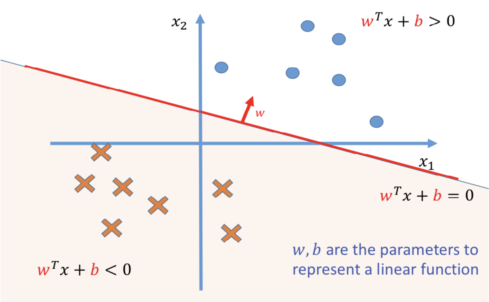
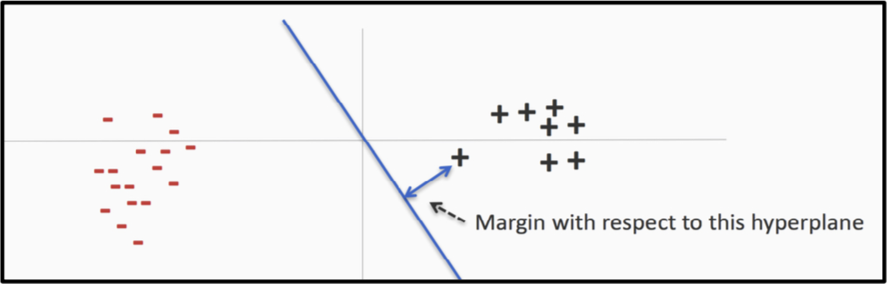
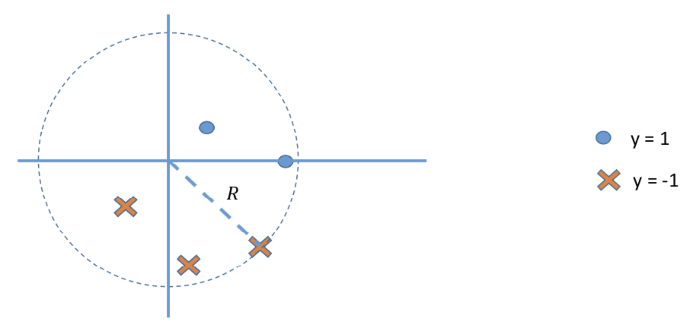
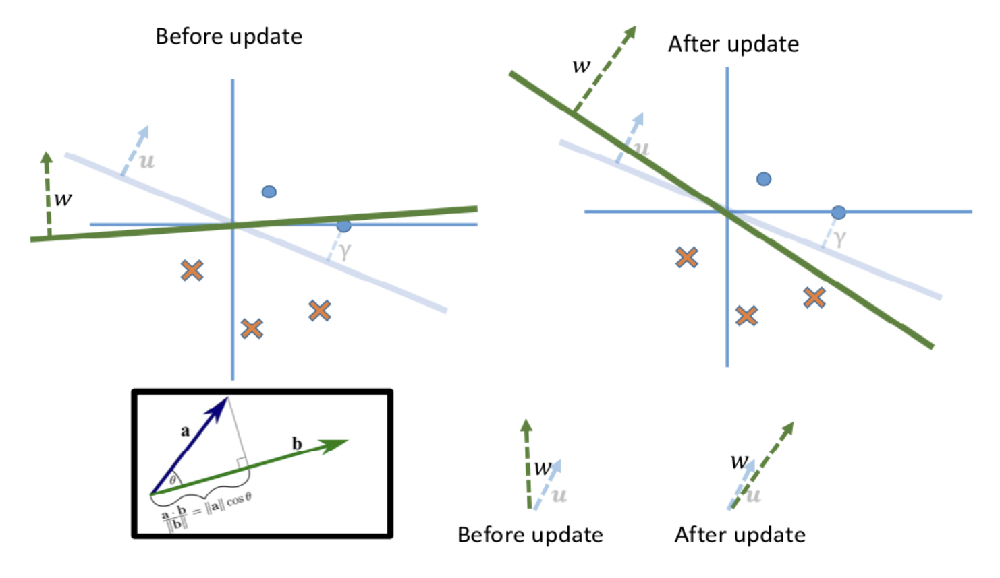

### 1. What Does a Perceptron Do?

A **perceptron** is a simple type of artificial neuron used for **binary classification**. It separates data into two classes (\(+1\) and \(-1\)) by learning a linear decision boundary.

#### **Decision Boundary**:
The perceptron uses the **activation** equation as the decision boundary:
\[
a = \sum_{d=1}^D w_d x_d + b
\]

where:
- \(x_d\): Input feature \(d\) of the data point \(x\).
- \(w_d\): Weight corresponding to feature \(x_d\).
- \(b\): Bias term (like a threshold).

The perceptron predicts the class of \(x\) by the sign of \(a\):
- If \(a > 0\): Predict \(+1\).
- If \(a \leq 0\): Predict \(-1\).

We call the line that separates the two classes the **decision boundary** also called **hyperplane** in higher dimensions.

For a given dataset, there can be many hyperplanes that correctly classify all points, which means that the choice of the decision boundary (hyperplane) itself is not unique. The perceptron algorithm just finds one of them.

---

### 2. What Are the Inputs to the Perceptron?

The perceptron **inputs** are:
1. The feature values \(x = (x_1, x_2, \ldots, x_D)\) of a data point.
2. The label \(y\) of the data point during training (for supervised learning).

The weights \(w = (w_1, w_2, \ldots, w_D)\) and bias \(b\) are **parameters that are learned during training**, not inputs.

#### **Training Input**:
During training, the perceptron uses:
- The dataset \(D = \{(x, y)\}\), which contains:
  - \(x = (x_1, x_2, \ldots, x_D)\): Input feature vectors.
  - \(y \in \{-1, +1\}\): True labels.

#### **Prediction Input**:
After training, the perceptron only takes:
- A new \(x = (x_1, x_2, \ldots, x_D)\), the feature vector of the data point to classify.

---

### 3. Why Are the Weights \(w_d\) Not Pre-Given?

The weights are **not pre-given** because the perceptron must learn the weights that define the decision boundary from the data.

#### **Why Learn the Weights?**
1. **Unknown Decision Boundary**:
   - Initially, we don’t know how to separate the two classes of data.
   - The perceptron algorithm learns the weights \(w_d\) (and bias \(b\)) so that the decision boundary separates the data as well as possible.

2. **Different Data Means Different Boundaries**:
   - Each dataset is unique, so the perceptron needs to adjust the weights to adapt to the data.
   - For example:
     - If one dataset separates classes based on \(x_1\) alone, the perceptron will give more importance (higher weight) to \(w_1\).
     - If another dataset depends on \(x_2\) and \(x_3\), the perceptron will adjust the weights accordingly.

3. **No Manual Assignment of Weights**:
   - In most real-world problems, we cannot guess the weights manually because datasets are too large or complex.

---
### Algorithm 5: PerceptronTrain(D, MaxIter)

This algorithm is used to train a perceptron model.

1. **Initialization**:

   - Set all weights \( w_d \) (for each feature \( d \)) to 0.
   - Set the bias \( b \) to 0.

2. **Iterate for a maximum number of iterations \( \text{MaxIter} \)**:

   - Loop through each example \( (x, y) \) in the dataset \( D \):
     - Compute the activation \( a = w_d x_d\).
     - Check the classification condition \( y_d a \leq 0 \):
       - If the condition is satisfied (meaning the perceptron misclassified the example):
         - Update the weights \( w_{d-new} \leftarrow w_d + y x_d \) for all \( d = 1, \ldots, D \).
         - Update the bias (suppose bias $b = 0$ in this case).

3. **Output the learned weights and bias.**

---

In the Perceptron Training algorithm, \( y a \leq 0 \) is the **classification condition** that determines if the perceptron made a mistake on a given training example \( (x, y) \).

Here’s what the components mean:

1. **\( a = \sum_{d=1}^D w_d x_d + b \):**
   - The perceptron computes a weighted sum of the input features \( x \), adjusted by the bias \( b \).
   - The sign of \( a \) determines the perceptron's classification.
     - If \( a > 0 \), the perceptron predicts \( +1 \).
     - If \( a \leq 0 \), the perceptron predicts \( -1 \).

2. **\( y \):**
   - The true label, \( y \), is \( +1 \) or \( -1 \).

3. **Multiplying \( y \) with \( a \):**
   - If **\( y a > 0 \)** means the activation \( a \) is with the same sign as \( y \), which is **correct**.
   - If **\( y a \leq 0 \)**, the perceptron has **misclassified** the example.

4. **Weight Update Formula:**
   \[
   \mathbf{w}_{\text{new}} = \mathbf{w} + y_n \mathbf{x}_n
   \]
   - **When \( y_n = +1 \):**
     - If \( \mathbf{x}_n \) should belong to the positive class but was misclassified:
     - The update **adds** \( \mathbf{x}_n \) to \( \mathbf{w} \), increasing the dot product \( \mathbf{w}^\top \mathbf{x}_n \).

   - **When \( y_n = -1 \):**
     - If \( \mathbf{x}_n \) should belong to the negative class but was misclassified:
     - The update **subtracts** \( \mathbf{x}_n \) from \( \mathbf{w} \) (since \( y_n = -1 \)), decreasing the dot product \( \mathbf{w}^\top \mathbf{x}_n \).

---

> **Question: Can a Perceptron model represent the boolean function XNOR? The table shows the results of XNOR computation on two independent binary variables.**

| \( X_1 \) | \( X_2 \) | \( Y \) |
|:---------:|:---------:|:-------:|
|     0     |     0     |    1    |
|     1     |     0     |    0    |
|     0     |     1     |    0    |
|     1     |     1     |    1    |

**Answer:**
**1. What does a perceptron do?**
- A perceptron is a single-layer neural network that can only classify data points that are **linearly separable**. This means the perceptron can draw a single straight line (or hyperplane in higher dimensions) to separate the outputs into two distinct classes.

**2. Truth table of XNOR**
- The XNOR function's truth table is as follows:

   | \( X_1 \) | \( X_2 \) | \( Y \) (Output) |
   |:---------:|:---------:|:---------------:|
   |     0     |     0     |        1        |
   |     1     |     0     |        0        |
   |     0     |     1     |        0        |
   |     1     |     1     |        1        |

**3. Plotting the XNOR function**
- If you plot \( X_1 \) and \( X_2 \) in a 2D plane with their outputs \( Y \), you get:
   - Points \( (0, 0) \) and \( (1, 1) \) belong to class \( Y = 1 \).
   - Points \( (1, 0) \) and \( (0, 1) \) belong to class \( Y = 0 \).

- These points form a "checkerboard" pattern, where class 1 and class 0 alternate diagonally. This pattern **cannot be separated by a single straight line**.

---

### 4. Does the Perceptron Always Converge?

The answer depends on the **nature of the data**.

#### Case 1: Linearly Separable Data

- **Definition**:  
  A dataset is linearly separable if there exists a hyperplane that perfectly separates the data into two classes.

- **Convergence Theorem**:  
  - The perceptron will **always converge** in a finite number of steps for linearly separable data.
  - The **number of mistakes \( t \) made before convergence** depends on the margin \( \gamma \) (separability of the data) and the maximum norm \( R \) of the data points:
    \[
    t \leq \frac{R^2}{\gamma^2}
    \]
   , which we will discuss in the next section.

#### Case 2: Non-Linearly Separable Data

- **If the data is not linearly separable**:
  - The perceptron does **not converge**.
  - Instead, it may enter an **infinite loop**, cycling through weight vectors as it tries to separate the inseparable.

- **Cycling Theorem**:  
  - The perceptron **repeatedly** encounters the same set of examples and makes no real progress, failing to find a solution and diving into an **infinite loop**.

---

### 5. How long does Perceptron take to converge?

#### Margin

The **margin \( \gamma \) of a specific separating hyperplane** is the smallest distance between any point (closest point) in the dataset and this hyperplane:

\[
\gamma(\mathbf{w}) = \min_{(x, y) \in D} \frac{y \cdot \mathbf{w}^\top x}{\|\mathbf{w}\|}
\]

where:
- \( x \) is the feature vector,
- \( y \) is the label (\(+1\) or \(-1\)),
- \( \mathbf{w} \) is the weight vector of this specific separating hyperplane.

The **margin \( \gamma_{\mathcal{D}} \) of a dataset \( \mathcal{D} \)** (sometimes called the **maximal margin**) is the **largest possible margin** you can achieve over *all* valid separating hyperplanes. In other words, among all \( \mathbf{w} \) that separate the data, you pick the one that yields the **maximum distance** to the closest data point.

\[
\gamma_{\mathcal{D}}
  = \max_{\mathbf{w}}
    \;\min_{(x,y)\,\in\,D}
    \;\frac{y \cdot \mathbf{w}^{T}x}{\|\mathbf{w}\|}
\]

A **larger margin** means the data points are farther away from the decision boundary, making it easier for the algorithm to find the correct hyperplane.

#### Mistake Bound Theorem

This theorem provides an upper bound on **the number of mistakes** the perceptron makes during training if the data is linearly separable:

\[
t \leq \frac{R^2}{\gamma_{\mathcal{D}}^2}
\]

where:

- \( R \): Radius of the smallest sphere containing all data points (\( \|x_n\|_2 \leq R \)).
- \( \gamma_{\mathcal{D}} \): Margin of the dataset (smallest distance from the hyperplane to any point).

##### Example

Imagine a dataset with two classes (blue and red points) and a hyperplane separating them:

- **Small margin**:  
  The points are near the hyperplane. Even slight changes in the perceptron’s weight vector can flip the classification of those “borderline” points, causing more misclassifications and subsequent updates.

- **Large margin**:  
  The points are far from the hyperplane. Even after several updates, most points remain correctly classified, so the algorithm converges quickly.

##### Conclusion

The margin provides an **upper limit on convergence time**:

- **Larger margins** → fewer mistakes → faster convergence.
- **Smaller margins** → more mistakes → slower convergence.

#### Visualization

where:
* \(\mathbf{u}\) is the optimal separating hyperplane.
* \(\mathbf{w}_t\) is the separating hyperplane before update.
* \(\mathbf{w}_{t+1}\) is the separating hyperplane after update.
* \(\gamma\) is the margin.

After the update, \( \mathbf{u}^\top \mathbf{w}_{t+1} \) is larger than \( \mathbf{u}^\top \mathbf{w}_t \) because of the value of \(cos(\theta)\):
- After \( t \) mistakes, \( \mathbf{u}^\top \mathbf{w}_t \geq t\gamma \).

The size of \( \|\mathbf{w}_{t+1}\| \) may increase but not too much:
- After \( t \) mistakes, \( \|\mathbf{w}_t\|^2 \leq tR^2 \).
