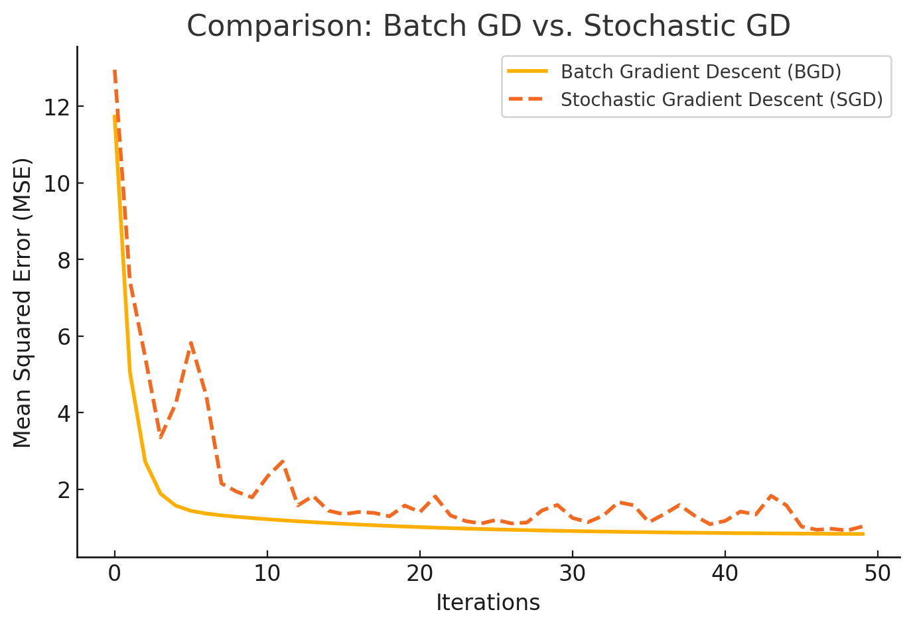

# Gradient Descent

Gradient Descent is an **optimization algorithm** used to find the best parameters (\(\theta\)) that minimize a given cost function, such as the **Mean Squared Error (MSE) in Linear Regression**. It is widely used in **machine learning and deep learning** to train models.

There are different **types of gradient descent**, and today, we will focus on:

1. **Batch Gradient Descent (BGD)**
2. **Stochastic Gradient Descent (SGD)**

Both methods aim to minimize a cost function, but they **differ in how they update the parameters**.

---

### Understanding the Cost Function

Before diving into the two methods, let's recall the **cost function** used in linear regression:

\[
J(\theta) = \frac{1}{N} \sum_{i=1}^{N} (h_{\theta}(x_i) - y_i)^2
\]

where:

- \( h_{\theta}(x_i) \) is the model's predicted value.
- \( y_i \) is the actual value.
- \( N \) is the total number of training examples.
- \( \theta \) are the model parameters that we want to optimize.

The **goal** of gradient descent is to **find the values of** \( \theta \) **that minimize** \( J(\theta) \).

---

### Batch Gradient Descent (BGD)

#### Definition

**Batch Gradient Descent** is a **full dataset optimization** method. It computes the gradient using the **entire training dataset** before updating the parameters.

#### Algorithm for Batch Gradient Descent

1. **Initialize parameters** \( \theta \) randomly or with zeros.
2. Compute the gradient (partial derivative of \( J(\theta) \) with respect to \( \theta \)):

   \[
   \nabla J(\theta) = \frac{2}{N} \sum_{i=1}^{N} (h_{\theta}(x_i) - y_i)x_i
   \]

3. **Update the parameters** using:

   \[
   \theta := \theta - \eta \cdot \nabla J(\theta)
   \]

   where \( \eta \) is the **learning rate**.

4. Repeat steps **2-3** until **convergence** (when updates become very small).

#### Pros of Batch Gradient Descent

✅ **More stable** and smooth convergence.  
✅ **Finds the optimal solution** more accurately.

#### Cons of Batch Gradient Descent

❌ **Slow for large datasets** since it processes all data at once.  
❌ **Memory intensive**—requires storing the entire dataset.

#### Pseudocode

```python
# Batch Gradient Descent (BGD)
Initialize θ randomly
For iteration in range(T):
    Compute gradient:
        grad = (2/N) * X.T * (Xθ - y)  # Uses all data points
    Update parameters:
        θ = θ - η * grad
Return final θ
```

---

### Stochastic Gradient Descent (SGD)

**Stochastic Gradient Descent (SGD)** updates the model **one training example at a time** instead of the entire dataset.

#### Algorithm for Stochastic Gradient Descent

1. **Initialize parameters** \( \theta \) randomly or with zeros.
2. For **each training example \( (x_i, y_i) \)**:

   - Compute the gradient for a single data point:

     \[
     \nabla J(\theta) = 2*(h_{\theta}(x_i) - y_i)x_i
     \]

   - Update the parameters:

     \[
     \theta := \theta - \eta \cdot \nabla J(\theta)
     \]

3. Repeat until convergence.

#### Pros of Stochastic Gradient Descent

✅ **Faster for large datasets** since it updates after each example.  
✅ **Less memory usage**—only needs one data point at a time.

#### Cons of Stochastic Gradient Descent

❌ **More noisy**—jumps around instead of smoothly converging.  
❌ May not find the **exact** optimal solution but **oscillate** near it.

#### Pseudocode

```python
# Stochastic Gradient Descent (SGD)
Initialize θ randomly
For iteration in range(T):
    Shuffle training data (optional but recommended)
    For each training sample (xi, yi):
        Compute gradient:
            grad = 2 * xi.T * (xiθ - yi)  # Uses only one data point
        Update parameters:
            θ = θ - η * grad
Return final θ
```

---

### Example: BGD vs. SGD

Let's consider a simple **linear equation**:

\[
y = \theta_1 x_1 + \theta_2 x_2 + b
\]

where:

- \( x_1 \) and \( x_2 \) are input features.
- \( \theta_1 \) and \( \theta_2 \) are the model parameters.
- \( b \) (bias term) is also included in calculations.

#### Step 1: Define Data (Small Example)

We take **three training examples** to make calculations clear:

| \( x_1 \) | \( x_2 \) | \( y \) |
| --------- | --------- | ------- |
| 1         | 2         | 5       |
| 2         | 3         | 8       |
| 3         | 4         | 11      |

Assume initial values:

- \( \theta_1 = 0 \), \( \theta_2 = 0 \), \( b = 0 \) (starting from zero).
- Learning rate \( \eta = 0.1 \).

#### Batch Gradient Descent Calculation

**Batch Gradient Descent (BGD)** updates the parameters using **all three examples at once**.

1. **Compute predictions** for all points using initial values:

   \[
   \hat{y} = \theta_1 x_1 + \theta_2 x_2 + b = 0 \cdot x_1 + 0 \cdot x_2 + 0 = 0
   \]

2. **Compute errors**:

   \[
   \text{Error} = \hat{y} - y = [0 - 5, 0 - 8, 0 - 11] = [-5, -8, -11]
   \]

3. **Compute gradients** (partial derivatives):

   \[
   \frac{\partial J}{\partial \theta_1} = \frac{2}{3} \sum (x_1 (\hat{y} - y)) = \frac{2}{3} [(1 \cdot -5) + (2 \cdot -8) + (3 \cdot -11)] = -14.67
   \]

   \[
   \frac{\partial J}{\partial \theta_2} = \frac{2}{3} \sum (x_2 (\hat{y} - y)) = \frac{2}{3} [(2 \cdot -5) + (3 \cdot -8) + (4 \cdot -11)] = -22.67
   \]

   \[
   \frac{\partial J}{\partial b} = \frac{2}{3} \sum (\hat{y} - y) = \frac{2}{3} (-5 - 8 - 11) = -16
   \]

4. **Update parameters**:

   \[
   \theta_1 = 0 - (0.1 \times -14.67) = 1.47
   \]

   \[
   \theta_2 = 0 - (0.1 \times -22.67) = 2.27
   \]

   \[
   b = 0 - (0.1 \times -16) = 1.6
   \]

#### Stochastic Gradient Descent Calculation

**SGD updates parameters using one example at a time.**

##### Iteration 1: First Training Example \((x_1 = 1, x_2 = 2, y = 5)\)

1. **Compute prediction**:

   \[
   \hat{y} = 0 \cdot 1 + 0 \cdot 2 + 0 = 0
   \]

2. **Compute error**:

   \[
   \hat{y} - y = 0 - 5 = -5
   \]

3. **Compute gradients**:

   \[
   \frac{\partial J}{\partial \theta_1} = 2 (-5 \cdot 1) = -10
   \]

   \[
   \frac{\partial J}{\partial \theta_2} = 2 (-5 \cdot 2) = -20
   \]

   \[
   \frac{\partial J}{\partial b} = 2 (-5) = -10
   \]

4. **Update parameters**:

   \[
   \theta_1 = 0 - (0.1 \times -10) = 1
   \]

   \[
   \theta_2 = 0 - (0.1 \times -20) = 2
   \]

   \[
   b = 0 - (0.1 \times -10) = 1
   \]

At this point, **SGD moves to the next training example**, while **BGD would have already used all three examples to compute its update.**

---

### Time Complexity

| Feature                           | Batch Gradient Descent (BGD)        | Stochastic Gradient Descent (SGD)         |
| --------------------------------- | ----------------------------------- | ----------------------------------------- |
| **Time Complexity per Iteration** | \( O(ND) \)                         | \( O(D) \)                                |
| **Total Time Complexity**         | \( O(TND) \)                        | \( O(TD) \)                               |
| **Parameter Updates**             | After full dataset is processed     | After each sample                         |
| **Memory Usage**                  | High (needs full dataset in memory) | Low (only processes one sample at a time) |
| **Convergence**                   | Smooth, more stable                 | Noisy, fluctuates but faster              |

where:

| **Symbol** | **Meaning**                                        |
| ---------- | -------------------------------------------------- |
| \( N \)    | Number of **training Samples** (# of row)       |
| \( D \)    | Number of **Features** per sample (# of x)    |
| \( T \)    | Number of **Iterations** (epochs) |

For example, \( N = 2\), \( D = 3\) with respect to the following table:

| Sample | Feature 1 (\(x_1\)) | Feature 2 (\(x_2\)) | Feature 3 (\(x_3\)) | Target (\(y\)) |
|---------|-----------------|-----------------|-----------------|------------|
| 1       | 2.3             | 1.5             | 0.8             | 10         |
| 2       | 3.1             | 2.2             | 1.3             | 12         |

---

### Visualizing the Difference

To help understand, let's imagine an **optimization landscape**:

- **Batch Gradient Descent** moves smoothly towards the minimum.
- **SGD** takes small, random steps in different directions but eventually reaches the minimum.

